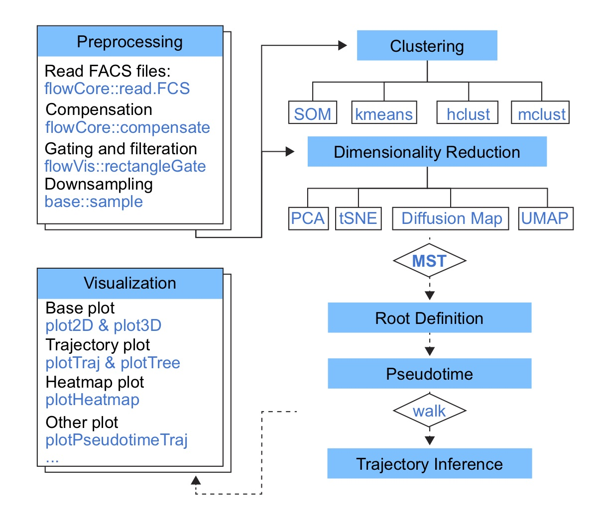

```{r use-libs, echo = FALSE, message = FALSE}
knitr::opts_chunk$set(echo = TRUE, cache = FALSE, 
                      warning = FALSE, message = TRUE)
```

## Abstract

The package **flowSpy** provides tools for differential trajectory analysis and visualization of flow cytometry data.


## 1 Introduction





## 2 Installation

`flowSpy` can be installed in one of two ways:

### 2.1 From Bioconductor 

The `flowSpy` package is not uploaded to Bioconductor server yet, so now you can only download it through Github.

`flowSpy` runs in the [R statistical computing environment](https://www.r-project.org/). You will need R version 3.4 or higher to have access to the latest features. 

``` {r install-bioconductor, eval = FALSE}

# The flowSpy package is not uploaded to Bioconductor server yet
if (!requireNamespace("BiocManager", quietly=TRUE))
    install.packages("BiocManager")
BiocManager::install("flowSpy")

library(flowSpy)

```

### 2.2 From Github

This requires the `devtools` package to be installed first.

``` {r install-github, eval = FALSE}

# If not already installed
install.packages("devtools") 
devtools::install_github("ytdai/flowSpy")

library(flowSpy)

```

## 3 Getting started with FSPY

## 3.1 Preprocessing

``` {r preprocess-read-fcs, fig.width = 5, fig.height = 4}

suppressMessages({
library(flowCore)
library(flowViz)
library(flowSpy)
})


# read Flow Cytometry Data
# a sample file
fcs.file <- system.file("extdata", "D2.fcs", package="flowSpy")

# head(fcs.data, 2)
fcs.data <- read.FCS(filename = fcs.file)

# Compensation
fcs.data <- compensate(fcs.data, spillover = fcs.data@description$SPILL)

# plot SSC-H and FSC-H
xyplot(`SSC-H` ~ `FSC-H`, data = fcs.data)

```


``` {r preprocess-rename, eval = T}
# Transform
colnames.mapping <- c(`FSC-A` = "FSC_A", `FSC-H` = "FSC_H", `FSC-W` = "FSC_W", 
                      `SSC-A` = "SSC_A", `SSC-H` = "SSC_H", `SSC-W` = "SSC_W",
                      `FITC-A` = "CD43", `PerCP-Cy5-5-A` = "PerCP", 
                      `APC-A` = "CD34", `APC-Alexa 700-A` = "APC_Alexa", 
                      `BV421-A` = "CD90", `BV510-A` = "CD45RA",
                      `BV605-A` = "CD31", `BV650-A` = "CD49f", 
                      `BV 735-A` = "CD73", `BV786-A` = "BV786", 
                      `PE-A` = "FLK1", `PE-Cy7-A` = "CD38", `Time` = "Time")

colnames(fcs.data) <- colnames.mapping[match(colnames(fcs.data), names(colnames.mapping))]

# define markers
markers <- c("CD34", "CD43", "CD38", "CD90", "CD49f", "CD31", "CD45RA", "FLK1", "CD73")
idx.markers <- match(markers, colnames(fcs.data))

fcs.d2 <- fcs.data@exprs
dim(fcs.d2)

```


### 3.2 Build an FSPY object

``` {r load-data, eval = T}

# load raw.data and meta.data of flowSy
data("fspy.data")

# view raw.data and meta.data
head(fspy.meta.data)
head(fspy.raw.data)

# show cell number in each time point
table(fspy.meta.data$stage)


```


``` {r create-object, eval = T}

# create an FSPY object using fspy.meta.data and fspy.log.data
object <- createFSPY(raw.data = fspy.raw.data, markers = markers,
                     meta.data = fspy.meta.data,
                     log.transform = F,
                     verbose = F)

# see information in object
object

```

### 3.3 Classifying cells

``` {r run-knn, eval = T}

object <- runKNN(object, knn = 30, verbose = F)


set.seed(1)
object <- runCluster(object, cluster.method = "som", xdim = 6, ydim = 6, verbose = F)

```


### 3.4 Reducing dimensionality

``` {r run-pca, eval = T, fig.width = 5, fig.height = 4}

object <- runFastPCA(object, verbose = F)

plot2D(object, item.use = c("PC1", "PC2"), color.by = "som.id", 
       alpha = 0.7, main = "PCA", show.cluser.id = T)

plot2D(object, item.use = c("PC1", "PC2"), color.by = "stage", 
       alpha = 0.7, main = "PCA", show.cluser.id = T)

```

``` {r run-pca-3d, eval = T, fig.width = 5, fig.height = 5}

plot3D(object, item.use = c("PC1", "PC2", "PC3"), color.by = "stage", main = "PCA")

```


``` {r run-tsne, eval = T, fig.width = 5, fig.height = 4}

object <- runTSNE(object, verbose = F)

plot2D(object, item.use = c("tSNE1", "tSNE2"), color.by = "som.id", 
       alpha = 0.7, main = "tSNE", show.cluser.id = T)

plot2D(object, item.use = c("tSNE1", "tSNE2"), color.by = "stage", 
       alpha = 0.7, main = "tSNE", show.cluser.id = T)

```


``` {r run-destiny, eval = T, fig.width = 5, fig.height = 4}

object <- runDiffusionMap(object, verbose = F)

plot2D(object, item.use = c("DC1", "DC2"), color.by = "som.id", 
       alpha = 0.7, main = "DiffusionMap", show.cluser.id = T)

plot2D(object, item.use = c("DC1", "DC2"), color.by = "stage", 
       alpha = 0.7, main = "DiffusionMap", show.cluser.id = T)
```

``` {r run-destiny-3d, eval = T, fig.width = 5, fig.height = 5}

plot3D(object, item.use = c("DC1", "DC2", "DC3"), color.by = "stage", main = "DiffusionMap")

```


``` {r run-umap, eval = T, fig.width = 5, fig.height = 4}

object <- runUMAP(object, verbose = F)

plot2D(object, item.use = c("UMAP1", "UMAP2"), color.by = "som.id", 
       alpha = 0.7, main = "UMAP", show.cluser.id = T)

plot2D(object, item.use = c("UMAP1", "UMAP2"), color.by = "stage", 
       alpha = 0.7, main = "UMAP", show.cluser.id = F)

```

### 3.5 Build tree

``` {r build-tree, eval = T, fig.width = 6, fig.height = 4}
object <- buildTree(object, cluster.type = "som", dim.type = "umap", verbose = F)

p <- plotTree(object, color.by = "CD34", show.node.name = T) 
p + scale_colour_gradientn(colors = c("blue", "red"))
```


### 3.6 Pseudotime calculation

``` {r pseudotime, eval = T, fig.width = 6, fig.height = 4}

object <- defRootCells(object, root.cells = c(24), verbose = F)

object <- runPseudotime(object)

plotPseudotimeDensity(object)

```


### 3.7 Trajectory inference

``` {r Trajectory, eval = T, fig.width = 10, fig.height = 10}

object <- defLeafCells(object, leaf.cells = c(6,35), pseudotime.cutoff = 0.5)

object <- runWalk(object)

plotPseudotimeTraj(object, cutoff = 0.2, var.cols = T) + scale_colour_gradientn(colors = c("blue", "red"))


```


### 3.8 Save object


``` {r save-object, eval = FALSE}

# save FSPY object
save(object, file = "your.fspy.Robj")

```

## 4 Advanced usage


### 4.1 The FSPY class


### 4.2 Clustering methods


### 4.3 Reducing dimensions


### 4.4 Trajectory inference algorithm


## Session info 

``` {r}
sessionInfo()
```


## References


