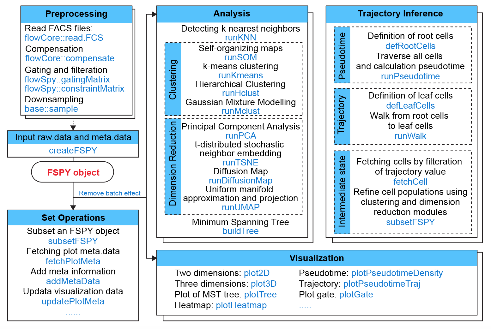

```{r use-libs, echo = FALSE, message = FALSE}
knitr::opts_chunk$set(echo = TRUE, cache = FALSE, 
                      warning = FALSE, message = TRUE)
```

## Abstract

High throughput cell-based assays with flow cytometric signals enable ones to analyze multiple single-cell parameters and identify cellular populations. 
Based on classical softwares for analyzing flow cytometry (FCS) data such as [`flowSOM`](https://bioconductor.org/packages/release/bioc/html/FlowSOM.html)[1] and [`SPADE`](https://github.com/nolanlab/spade)[2], methods for identifying intermediate states during a biological process are very important in cellular trajectory inference. 
To objectively define the intermediate states based on time courses FCS data, we present [`flowSpy`](https://github.com/ytdai/flowSpy), a trajectory inference and visualization toolkit of flow cytometry data. `flowSpy` package was applied to flow cytometry data of directional induced differentiation of Human embryonic stem cell line HUES 9 (HUES9) and tracking the trajectory when HUES9 was induced into mesodermal cells, hemogenic endothelium and hematopoietic stem/progenitor cells in succession. 

## 1 Introduction

The `flowSpy` package provides an analysis toolkit for flow cytometry data. This vignette presents an overview of time courses flow cytometry data analysis workflow with `flowSpy`. `flowSpy` was developed to analyze cellular population and inference differential trajectory based on a series of algorithms. `flowSpy` was originally developed to analyze time courses FCS data such as cell differentiation, although it also supports other experimental workflows such as gating and subpopulation identification from cancer tissues.

`flowSpy` can help you to perform four main types of analysis:

- Clustering. `flowSpy` can help you to discover and identify subtypes of cells. 

- Reducing Dimensions. Severval dimensionality reduction method are proveided in `flowSpy` package such as principal components analysis (PCA) and t-distributed stochastic neighbor embedding (tSNE).

- Pseudotime and Trajectory Inference. `flowSpy` can help you to construct the celluar differential based on minimum spanning tree approach.

- Intermediate cell fate definition. Subset FCS data set in `flowSpy` and find the key intermediate cell states.

<center>  </center>

<center> **Workflow of flowSpy** </center>

## 2 Installation

`flowSpy` can be installed in one of two ways:

### 2.1 From Bioconductor 

The `flowSpy` package is not uploaded to Bioconductor server yet, so now you can only download it through Github.

`flowSpy` runs in the [R statistical computing environment](https://www.r-project.org/). You will need R version 3.4 or higher to have access to the latest features. 

``` {r install-bioconductor, eval = FALSE}

# The flowSpy package is not uploaded to Bioconductor server yet
# Please install it through GitHub.
if (!requireNamespace("BiocManager", quietly=TRUE))
    install.packages("BiocManager")
BiocManager::install("flowSpy")

library(flowSpy)

```

### 2.2 From Github

This requires the `devtools` package to be installed first.

``` {r install-github, eval = FALSE}

# If not already installed
install.packages("devtools") 
devtools::install_github("ytdai/flowSpy")

library(flowSpy)

```

## 3 Getting started with FSPY

The [datasets](https://github.com/ytdai/flowSpy-dataset) analyzed in this study are available from the GitHub repository (https://github.com/ytdai/flowSpy-dataset). It can be downloaded through [git](https://git-scm.com/) `git clone https://github.com/ytdai/flowSpy-dataset.git`, or via web page. 

This dataset was generated based on an in-house induced differentiation protocol of human embryonic stem cells. Nine cellular surface markers were evaluated during the experiment: CD34, CD43, CD38, CD90, CD49f, CD31, CD45RA, FLK1 and CD73. By add different cytokines in differen days, Human embryonic stem cell line HUES 9 (HUES9) were directional differentiated into mesodermal cells (Day 4), hemogenic endothelium (Day 6) and Hematopoietic Stem/Progenitor cells (HSPC, Day 8) in succession. Cellular surface markers were continuous changes during the induction process.

The main goal of this analysis workflow was to identify cell subtypes in each time point, track the differential trajctory of cell populations, calculation pseudotime of each cell and filteration of cells which play an key role in this biological progress.

### 3.1 Preprocessing

The preprocessing steps in flowSpy are based on some packages on Bioconductor. It need to be pre-installed before running flowSpy. For example, the FCS data is read via `flowCore::read.FCS`, and the compensation is made via `flowCore::compensate`. Also, you can visulaze different channels using `flowViz` and preform transformation using `flowCore::logTransform`.


``` {r preprocess-load-packages, eval = T}

suppressMessages({
library(ggplot2)
library(LSD)
library(flowCore)
library(flowViz)
library(flowSpy)
library(LSD)
})
```


``` {r preprocess-read-fcs, eval = FALSE}
# Read Flow Cytometry Data
# A sample file
# It can be downloaded via `git clone https://github.com/ytdai/flowSpy-dataset.git` 
# fcs.path musted be modified based on the download directory from GitHub
fcs.path <- "../../flowSpy-dataset/FCS/"
fcs.file <- paste0(fcs.path, "D12.fcs")

# Read flow cytomery data via flowCore::read.FCS
fcs.data <- flowCore::read.FCS(filename = fcs.file)

# If you want to see the first 6 rows of the FCS data 
head(fcs.data, 2)

# Make compensation
# The essential premise of compensation is that some fluorochromes may register 
# signals in detectors that do not correspond to their primary detector. If you 
# have adjust it on the flow cytometer, you can just make componsation through 
# flowCore::compensate base on the spillover matrix fcs.data@description$SPILL in 
# you flow cytometer data.
fcs.data <- flowCore::compensate(fcs.data, spillover = fcs.data@description$SPILL)

# Visualization of SSC-H and FSC-H
xyplot(`SSC-A` ~ `FSC-A`, data = fcs.data)
```

<center>  </center>

<center> **flowVis of FSC-H and SSC-H"** </center>

Before started building an FSPY object, it'e better to rename the colnames of `fcs.data`. 


``` {r preprocess-rename, eval = FALSE}
# Renames of colnames of fcs.data
colnames.mapping <- c(`FSC-A` = "FSC_A", `FSC-H` = "FSC_H", `FSC-W` = "FSC_W", 
                      `SSC-A` = "SSC_A", `SSC-H` = "SSC_H", `SSC-W` = "SSC_W",
                      `FITC-A` = "CD43", `PerCP-Cy5-5-A` = "PerCP", 
                      `APC-A` = "CD34", `APC-Alexa 700-A` = "APC_Alexa", 
                      `BV421-A` = "CD90", `BV510-A` = "CD45RA",
                      `BV605-A` = "CD31", `BV650-A` = "CD49f", 
                      `BV 735-A` = "CD73", `BV786-A` = "BV786", 
                      `PE-A` = "FLK1", `PE-Cy7-A` = "CD38", `Time` = "Time")

colnames(fcs.data) <- colnames.mapping[match(colnames(fcs.data), names(colnames.mapping))]

fcs.d0 <- fcs.data@exprs
```

When FCS data of fcs.data was transformed into a matrix, we can use visualization packages to plot FCS signals, such as `heatscatter` from package [`LSD`](https://cran.r-project.org/web/packages/LSD/index.html).

``` {r preprocess-gating-heatscatter, eval = FALSE}

# Here we recommend heatscatter, a plot method for visualization of density of FCS data.
# This function is from LSD::heatscatter
fcs.d0 <- fcs.d0[fcs.d0[, "FSC_A"] > 0, ]
fcs.d0 <- fcs.d0[fcs.d0[, "SSC_A"] > 0, ]
heatscatter(fcs.d0[, "FSC_A"], fcs.d0[, "SSC_A"], 
            cexplot = 0.3, main = "FCS in Day 0 before Gating", 
            xlab = "FSC_A", ylab = "SSC_A")

```

<center>  </center>

<center> **Heatscatter plot of FSC-A and SSC-A before Gating"** </center>

Before merge FCS data into one matrix, gating must be performed to filter dead cells and adhered cells. After the signal values from FCS data were transformed into a matrix, we can use `gatingMatrix` to remove dead cells and adhered cells. Or it is recommended to write a fitting function to finish the filteration.

``` {r preprocess-gating-flowSpy, eval = FALSE}

# gating FCS matrix using flowSpy::gatingMatrix
lower.gate <- c(FSC_A = 60000, SSC_A = 30000,
                FSC_H = 40000, FSC_W = 60000,
                SSC_H = 20000, SSC_W = 60000)
upper.gate <- c(FSC_A = 200000, SSC_A = 150000,
                FSC_H = 120000, FSC_W = 120000,
                FSC_H = 130000, FSC_W = 110000)

fcs.d0.filter <- gatingMatrix(fcs.d0, lower.gate = lower.gate, upper.gate = upper.gate)

heatscatter(fcs.d0.filter[, "FSC_A"], fcs.d0.filter[, "SSC_A"], 
            cexplot = 0.3, main = "FCS in Day 0 after Gating", 
            xlab = "FSC_A", ylab = "SSC_A")

```

<center>  </center>

<center> **Heatscatter plot of FSC-A and SSC-A after Gating"** </center>


In order to ensure the efficiency of calculation and avoiding migration for one day, the downsampling step must be taken to make sure the merged FCS data matrix enrolled the same sample sizes for each day.

``` {r preprocess-downsampling, eval = FALSE}

sample.size = 2000
set.seed(1)
fcs.d0.downsample <- fcs.d0.filter[sample(1:nrow(fcs.d0.filter), sample.size), ]

# output data 
write.table(fcs.d2.downsample, paste0("../../dataset/D0.sub2000.txt"), 
            row.names = F, col.names = T, quote = F, sep = "\t")
```

In the analysis of FSPY workflow, it is recommended to remove batch effects for each time point. Batch effects in FCS data were usually caused by unstable voltage. In the example dataset, we collected cell sample at a specific time of each two days to make sure interval between every time point was equal. But batch effect is ineluctable. You can choose to use built-in function `correctBatchFSPY` provided in `flowSpy` packages, or you can choose to use other method before building an FSPY object. 
The methology of removing batch effects in `flowSpy` refers to `ComBat` function in  [`sva`](https://bioconductor.org/packages/release/bioc/html/sva.html) package, which can correct batch effects in by detecting mutual nearest neighbors (MNNs). 

``` {r preprocess-batch, eval = FALSE}

# read FCS file generating by 


```

### 3.2 Build an FSPY object

``` {r load-data, eval = F, fig.width = 9, fig.height = 6}

# load raw.data and meta.data of flowSy
data("FSPYdata")

# view raw.data and meta.data
head(fspy.meta.data)
head(fspy.raw.data)

# show cell number in each time point
table(fspy.meta.data$stage)

markers.plot <- c("CD43", "CD90")

par(mfrow=c(2,3))
for (day in c("D0","D2","D4","D6","D8","D10")) {
  sub.fspy.raw.data <- fspy.raw.data[grep(day, rownames(fspy.raw.data)), ]
  px <- sub.fspy.raw.data[, which(colnames(sub.fspy.raw.data) == "CD43")]
  py <- sub.fspy.raw.data[, which(colnames(sub.fspy.raw.data) == "CD90")]
  heatscatter(px, py, cexplot = 0.3,
              xlim = c(0,5), ylim = c(0,5),
              main = day, xlab = "CD43", ylab = "CD90")
}


```


``` {r create-object, eval = F}
par(mfrow=c(1,1))

# create an FSPY object using fspy.meta.data and fspy.log.data
object <- createFSPY(raw.data = fspy.raw.data, markers = markers,
                     meta.data = fspy.meta.data,
                     log.transform = F)

# see information in object
object

```

### 3.3 Classifying cells

``` {r run-knn, eval = F}

object <- runKNN(object, knn = 30)


set.seed(1)
object <- runCluster(object, cluster.method = "som", xdim = 6, ydim = 6)

```


### 3.4 Reducing dimensionality

``` {r run-pca, eval = F, fig.width = 5, fig.height = 4}

object <- runFastPCA(object)

plot2D(object, item.use = c("PC1", "PC2"), color.by = "som.id", 
       alpha = 0.7, main = "PCA", show.cluser.id = T)

plot2D(object, item.use = c("PC1", "PC2"), color.by = "stage", 
       alpha = 0.7, main = "PCA", show.cluser.id = T)

```

``` {r run-pca-3d, eval = F, fig.width = 5, fig.height = 5}

plot3D(object, item.use = c("PC1", "PC2", "PC3"), color.by = "stage", main = "PCA")

```


``` {r run-tsne, eval = F, fig.width = 5, fig.height = 4}

object <- runTSNE(object)

plot2D(object, item.use = c("tSNE1", "tSNE2"), color.by = "som.id", 
       alpha = 0.7, main = "tSNE", show.cluser.id = T)

plot2D(object, item.use = c("tSNE1", "tSNE2"), color.by = "stage", 
       alpha = 0.7, main = "tSNE", show.cluser.id = T)

```


``` {r run-destiny, eval = F, fig.width = 5, fig.height = 4}

object <- runDiffusionMap(object)

plot2D(object, item.use = c("DC1", "DC2"), color.by = "som.id", 
       alpha = 0.7, main = "DiffusionMap", show.cluser.id = T)

plot2D(object, item.use = c("DC1", "DC2"), color.by = "stage", 
       alpha = 0.7, main = "DiffusionMap", show.cluser.id = T)
```

``` {r run-destiny-3d, eval = F, fig.width = 5, fig.height = 5}

plot3D(object, item.use = c("DC1", "DC2", "DC3"), color.by = "stage", main = "DiffusionMap")

```


``` {r run-umap, eval = F, fig.width = 5, fig.height = 4}

object <- runUMAP(object)

plot2D(object, item.use = c("UMAP1", "UMAP2"), color.by = "som.id", 
       alpha = 0.7, main = "UMAP", show.cluser.id = T)

plot2D(object, item.use = c("UMAP1", "UMAP2"), color.by = "stage", 
       alpha = 0.7, main = "UMAP", show.cluser.id = F)

```

### 3.5 Build tree

``` {r build-tree, eval = F, fig.width = 6, fig.height = 4}
object <- buildTree(object, cluster.type = "som", dim.type = "umap")

p <- plotTree(object, color.by = "CD34", show.node.name = T) 
p + scale_colour_gradientn(colors = c("blue", "red"))

```


### 3.6 Pseudotime calculation

``` {r pseudotime, eval = F, fig.width = 6, fig.height = 4}

object <- defRootCells(object, root.cells = c(24))

object <- runPseudotime(object)

plotPseudotimeDensity(object)

p <- plotTree(object, color.by = "CD34", show.node.name = T, 
              as.tree = T, root.id = 24) 
p + scale_colour_gradientn(colors = c("blue", "red"))

```


### 3.7 Trajectory inference

``` {r Trajectory, eval = F, fig.width = 10, fig.height = 10}

object <- defLeafCells(object, leaf.cells = c(6,35), pseudotime.cutoff = 0.5)

object <- runWalk(object)

plotPseudotimeTraj(object, cutoff = -1, var.cols = T) + scale_colour_gradientn(colors = c("blue", "red"))

plotPseudotimeTraj(object, cutoff = 0.2, var.cols = T) + scale_colour_gradientn(colors = c("blue", "red"))


```


### 3.8 Save object


``` {r save-object, eval = FALSE}

# save FSPY object
save(object, file = "your.fspy.Robj")

```

## 4 Advanced usage


### 4.1 The FSPY class


### 4.2 Clustering methods


### 4.3 Reducing dimensions


### 4.4 Trajectory inference algorithm


## Session info 

``` {r}
sessionInfo()
```


## References


