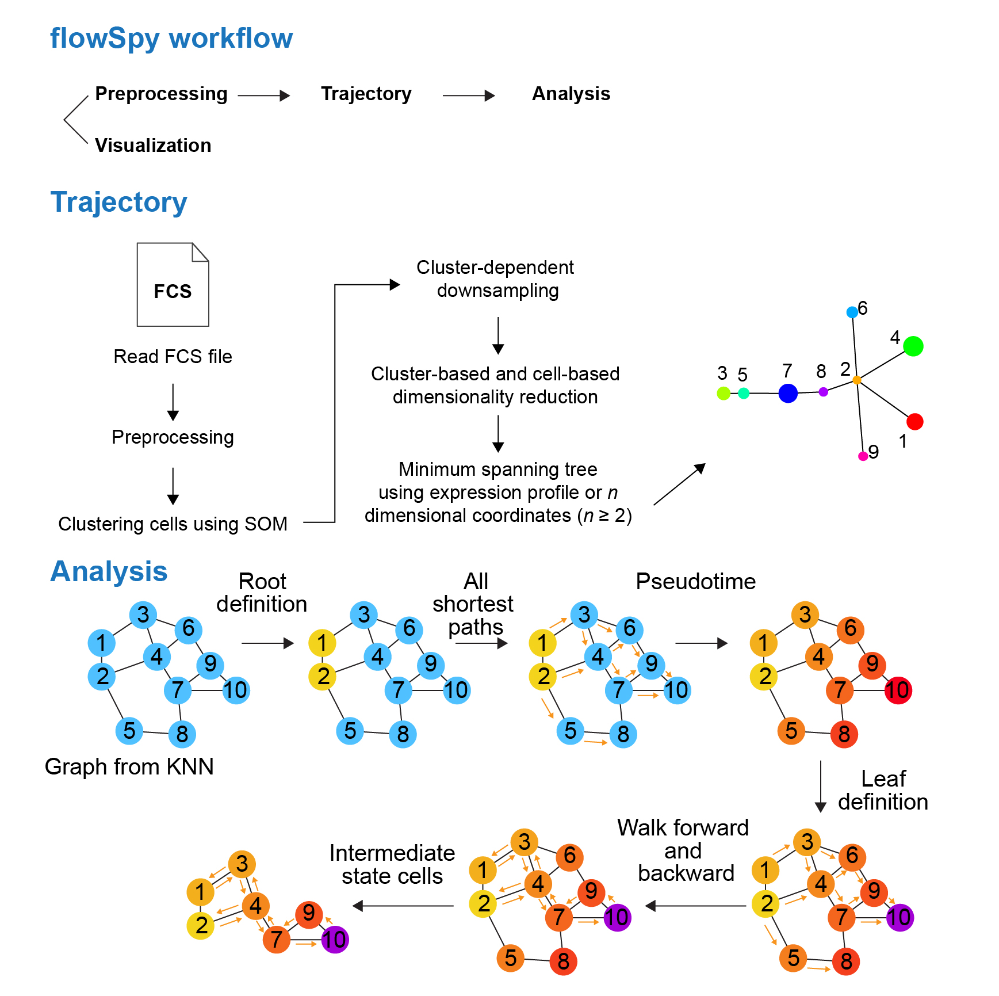

```{r echo = FALSE, message = FALSE}
knitr::opts_chunk$set(echo = TRUE, cache = FALSE, eval = TRUE,
                      warning = FALSE, message = TRUE)
```

## Introduction

Although multidimensional single-cell-based flow and mass cytometry have been increasingly applied to microenvironmental composition and stem-cell research, integrated analysis workflows to facilitate the interpretation of experimental cytometry data remain underdeveloped. We present flowSpy, a comprehensive R package designed for the analysis and interpretation of flow and mass cytometry data. We applied flowSpy to mass cytometry and time-course flow cytometry data to demonstrate the usage and practical utility of its computational modules. flowSpy is a reliable tool for multidimensional cytometry data workflows and produces compelling results for trajectory construction and pseudotime estimation. 


## Overview of flowSpy workflow

The flowSpy package is developed to complete the majority of standard analysis and visualization workflow for FCS data. In flowSpy workflow, an S4 object in R is built to implement the statistical and computational approach, and all computational modules are integrated into one single channel which only requires a specified input data format. Computational modules of flowSpy can be divided into four main parts (Fig. 1): preprocessing, trajectory, analysis and visualization. 


- **Preprocessing**. Data import, compensation, quality control, filtration, normalization and merge cells from different samples can be implemented in the preprocessing module. After preprocessing, a matrix contains clean cytometric signaling data, a data.frame containing meta-information of the experiment and a vector contains all markers enrolled in the computational process are required to build an FPSY object. 


- **Trajectory**. Cells built in the FSPY object are classfied into different clusters based on the expression level of input markers. You can choose different clustering methods by inputting different parameters. After clustering, cells are downsampled in a cluster-dependent fashion to reduce the total cell size and avoid small cluster deletion. Dimensionality reduction for both cells and clusters are also implemented in the clustering procedure. After dimensionality reduction, we use Minimus Spanning Tree (MST) to construct cell trajectory.


- **Analysis**. This module is design for time couse FCS data. Before running pseudotime, root cells must be defined first based on users' priori knowledge. Root cells in flowSpy workflow are the initial cells of the trajectory tree. So it can be set using one vertex node of the tree or a cluster of cells with specific antibodies combination. Intermediate state evaluation is also envolved in the pseudotime module. Leaf cells are defined by the end node of trajectory tree or the end stage of the experiment. Intermediate state cells are cells with higher betweenness in the graph built on cell-cell connection, which play an important role between the connection of root cells and leaf cells.


- **Visualization**. The visualization module can provide clear and concise visualization of FCS data in an effective and easy-to-comprehend manner. flowSpy package offers various plotting functions to generate customizable and publication-quality plots. Two-dimensional or three-dimensional plot can fit most requirement from dimensionality reduction results. And tree-based plot can visualize cell trajectory as force-directed layout tree. Other special plots such as heatmap and violin plot are also provided in flowSpy.


<center>  </center>

<center> **Fig. 1. Workflow of flowSpy** </center>


``` {r eval = TRUE, fig.width = 6, fig.height = 5}

# Loading packages
suppressMessages({
library(ggplot2)
library(flowSpy)
library(flowCore)
library(stringr)
})

# Read fcs files
fcs.path <- system.file("extdata", package = "flowSpy")
fcs.files <- list.files(fcs.path, pattern = '.FCS$', full = TRUE)

fcs.data <- runExprsMerge(fcs.files, comp = FALSE, transformMethod = "none")

# Refine colnames of fcs data
recol <- c(`FITC-A<CD43>` = "CD43", `APC-A<CD34>` = "CD34", 
           `BV421-A<CD90>` = "CD90", `BV510-A<CD45RA>` = "CD45RA", 
           `BV605-A<CD31>` = "CD31", `BV650-A<CD49f>` = "CD49f",
           `BV 735-A<CD73>` = "CD73", `BV786-A<CD45>` = "CD45", 
           `PE-A<FLK1>` = "FLK1", `PE-Cy7-A<CD38>` = "CD38")
colnames(fcs.data)[match(names(recol), colnames(fcs.data))] = recol
fcs.data <- fcs.data[, recol]

day.list <- c("D0", "D2", "D4", "D6", "D8", "D10")
meta.data <- data.frame(cell = rownames(fcs.data),
                        stage = str_replace(rownames(fcs.data), regex(".FCS.+"), "") )
meta.data$stage <- factor(as.character(meta.data$stage), levels = day.list)

markers <- c("CD43","CD34","CD90","CD45RA","CD31","CD49f","CD73","CD45","FLK1","CD38")

# Build the FSPY object
fspy <- createFSPY(raw.data = fcs.data, markers = markers,
                   meta.data = meta.data,
                   normalization.method = "log",
                   verbose = TRUE)

# See information
fspy
```

``` {r eval = TRUE, fig.width = 6, fig.height = 5}
# Cluster cells by SOM algorithm
# Set random seed to make results reproducible
set.seed(1)
fspy <- runCluster(fspy, cluster.method = "som")

# Do not perform downsampling
set.seed(1)
fspy <- processingCluster(fspy)

# run Principal Component Analysis (PCA)
fspy <- runFastPCA(fspy)

# run t-Distributed Stochastic Neighbor Embedding (tSNE)
fspy <- runTSNE(fspy)

# run Diffusion map
fspy <- runDiffusionMap(fspy)

# run Uniform Manifold Approximation and Projection (UMAP)
fspy <- runUMAP(fspy)

# build minimum spanning tree based on tsne
fspy <- buildTree(fspy, dim.type = "tsne", dim.use = 1:2)

# DEGs of different branch
diff.list <- runDiff(fspy)

# define root cells
fspy <- defRootCells(fspy, root.cells = c(28,26))

# run pseudotime
fspy <- runPseudotime(fspy, verbose = TRUE, dim.type = "raw")

# define leaf cells
fspy <- defLeafCells(fspy, leaf.cells = c(27, 13), verbose = TRUE)

# run walk between root cells and leaf cells
fspy <- runWalk(fspy, verbose = TRUE)

# Save object
if (FALSE) {
  save(fspy, file = "Path to you output directory")
}

######################## Visualization

# Plot 2D tSNE. And cells are colored by cluster id
plot2D(fspy, item.use = c("tSNE_1", "tSNE_2"), color.by = "cluster.id", 
       alpha = 1, main = "tSNE", category = "categorical", show.cluser.id = TRUE)

# Plot 2D UMAP. And cells are colored by cluster id
plot2D(fspy, item.use = c("UMAP_1", "UMAP_2"), color.by = "cluster.id", 
       alpha = 1, main = "UMAP", category = "categorical", show.cluser.id = TRUE)

# Plot 2D tSNE. And cells are colored by cluster id
plot2D(fspy, item.use = c("tSNE_1", "tSNE_2"), color.by = "branch.id", 
       alpha = 1, main = "tSNE", category = "categorical", show.cluser.id = TRUE)

# Plot 2D UMAP. And cells are colored by cluster id
plot2D(fspy, item.use = c("UMAP_1", "UMAP_2"), color.by = "branch.id", 
       alpha = 1, main = "UMAP", category = "categorical", show.cluser.id = TRUE)


# Plot 2D tSNE. And cells are colored by stage
plot2D(fspy, item.use = c("tSNE_1", "tSNE_2"), color.by = "stage", 
       alpha = 1, main = "UMAP", category = "categorical") +
   scale_color_manual(values = c("#00599F","#009900","#FF9933",
                                 "#FF99FF","#7A06A0","#FF3222"))

# Plot 2D UMAP. And cells are colored by stage
plot2D(fspy, item.use = c("UMAP_1", "UMAP_2"), color.by = "stage", 
       alpha = 1, main = "UMAP", category = "categorical") +
   scale_color_manual(values = c("#00599F","#009900","#FF9933",
                                 "#FF99FF","#7A06A0","#FF3222"))

# Tree plot
plotTree(fspy, color.by = "D0.percent", show.node.name = TRUE, cex.size = 1) + 
  scale_colour_gradientn(colors = c("#00599F", "#EEEEEE", "#FF3222"))

plotTree(fspy, color.by = "CD43", show.node.name = TRUE, cex.size = 1) + 
  scale_colour_gradientn(colors = c("#00599F", "#EEEEEE", "#FF3222"))


# plot clusters
plotCluster(fspy, item.use = c("tSNE_1", "tSNE_2"), category = "numeric",
            size = 100, color.by = "CD45RA") + 
  scale_colour_gradientn(colors = c("#00599F", "#EEEEEE", "#FF3222"))

# plot pie tree
plotPieTree(fspy, cex.size = 3, size.by.cell.number = TRUE) + 
  scale_fill_manual(values = c("#00599F","#FF3222","#009900",
                               "#FF9933","#FF99FF","#7A06A0"))

# plot pie cluster
plotPieCluster(fspy, item.use = c("tSNE_1", "tSNE_2"), cex.size = 40) + 
  scale_fill_manual(values = c("#00599F","#FF3222","#009900",
                               "#FF9933","#FF99FF","#7A06A0"))

# plot heatmap of cluster
plotClusterHeatmap(fspy)
plotBranchHeatmap(fspy)

# Violin plot
plotViolin(fspy, color.by = "cluster.id", marker = "CD45RA", text.angle = 90)
plotViolin(fspy, color.by = "branch.id", marker = "CD45RA", text.angle = 90)

# UMAP plot colored by pseudotime
plot2D(fspy, item.use = c("UMAP_1", "UMAP_2"), category = "numeric",
            size = 1, color.by = "pseudotime") + 
  scale_colour_gradientn(colors = c("#F4D31D", "#FF3222","#7A06A0"))

# tSNE plot colored by pseudotime
plot2D(fspy, item.use = c("tSNE_1", "tSNE_2"), category = "numeric",
            size = 1, color.by = "pseudotime") + 
 scale_colour_gradientn(colors = c("#F4D31D", "#FF3222","#7A06A0"))

# denisty plot by different stage
plotPseudotimeDensity(fspy, adjust = 1) + 
  scale_color_manual(values = c("#00599F","#009900","#FF9933",
                                "#FF99FF","#7A06A0","#FF3222"))
# Tree plot
plotTree(fspy, color.by = "pseudotime", cex.size = 1.5) + 
 scale_colour_gradientn(colors = c("#F4D31D", "#FF3222","#7A06A0"))

plotViolin(fspy, color.by = "cluster.id", order.by = "pseudotime",
           marker = "CD49f", text.angle = 90)

# trajectory value
plotPseudotimeTraj(fspy, var.cols = TRUE) + 
 scale_colour_gradientn(colors = c("#F4D31D", "#FF3222","#7A06A0"))

plotPseudotimeTraj(fspy, cutoff = 0.05, var.cols = TRUE) + 
 scale_colour_gradientn(colors = c("#F4D31D", "#FF3222","#7A06A0"))

plotHeatmap(fspy, downsize = 1000, cluster_rows = TRUE, clustering_method = "ward.D",
            color = colorRampPalette(c("#00599F","#EEEEEE","#FF3222"))(100))

# plot cluster
plotCluster(fspy, item.use = c("tSNE_1", "tSNE_2"), color.by = "traj.value.log", 
            size = 10, show.cluser.id = TRUE, category = "numeric") + 
 scale_colour_gradientn(colors = c("#EEEEEE", "#FF3222", "#CC0000", "#CC0000"))

# Show session information
sessionInfo()

```

## References


1. Hahne F, Arlt D, Sauermann M, Majety M, Poustka A, Wiemann S, Huber W: Statistical methods and software for the analysis of highthroughput reverse genetic assays using flow cytometry readouts. Genome Biol 2006, 7:R77.
2. Olsen LR, Leipold MD, Pedersen CB, Maecker HT: The anatomy of single cell mass cytometry data. Cytometry A 2019, 95:156-172.
3. Butler A, Hoffman P, Smibert P, Papalexi E, Satija R: Integrating single-cell transcriptomic data across different conditions, technologies, and species. Nat Biotechnol 2018, 36:411-420.
4. Trapnell C, Cacchiarelli D, Grimsby J, Pokharel P, Li S, Morse M, Lennon NJ, Livak KJ, Mikkelsen TS, Rinn JL: The dynamics and regulators of cell fate decisions are revealed by pseudotemporal ordering of single cells. Nat Biotechnol 2014, 32:381-386.
5. Kiselev VY, Yiu A, Hemberg M: scmap: projection of single-cell RNA-seq data across data sets. Nat Methods 2018, 15:359-362.
6. Amir el AD, Davis KL, Tadmor MD, Simonds EF, Levine JH, Bendall SC, Shenfeld DK, Krishnaswamy S, Nolan GP, Pe'er D: viSNE enables visualization of high dimensional single-cell data and reveals phenotypic heterogeneity of leukemia. Nat Biotechnol 2013, 31:545-552.
7. Haghverdi L, Buettner F, Theis FJ: Diffusion maps for high-dimensional single-cell analysis of differentiation data. Bioinformatics 2015, 31:2989-2998.
8. Becht E, McInnes L, Healy J, Dutertre CA, Kwok IWH, Ng LG, Ginhoux F, Newell EW: Dimensionality reduction for visualizing single-cell data using UMAP. Nat Biotechnol 2018.
9. Wang L, Hoffman RA: Standardization, Calibration, and Control in Flow Cytometry. Curr Protoc Cytom 2017, 79:1 3 1-1 3 27.
10. Hahne F, LeMeur N, Brinkman RR, Ellis B, Haaland P, Sarkar D, Spidlen J, Strain E, Gentleman R: flowCore: a Bioconductor package for high throughput flow cytometry. BMC Bioinformatics 2009, 10:106.
11. Sarkar D, Le Meur N, Gentleman R: Using flowViz to visualize flow cytometry data. Bioinformatics 2008, 24:878-879.
12. Van Gassen S, Callebaut B, Van Helden MJ, Lambrecht BN, Demeester P, Dhaene T, Saeys Y: FlowSOM: Using self-organizing maps for visualization and interpretation of cytometry data. Cytometry A 2015, 87:636-645.
13. Qiu P, Simonds EF, Bendall SC, Gibbs KD, Jr., Bruggner RV, Linderman MD, Sachs K, Nolan GP, Plevritis SK: Extracting a cellular hierarchy from high-dimensional cytometry data with SPADE. Nat Biotechnol 2011, 29:886-891.
14. Chen H, Lau MC, Wong MT, Newell EW, Poidinger M, Chen J: Cytofkit: A Bioconductor Package for an Integrated Mass Cytometry Data Analysis Pipeline. PLoS Comput Biol 2016, 12:e1005112.
15. Chattopadhyay PK, Winters AF, Lomas WE, 3rd, Laino AS, Woods DM: High-Parameter Single-Cell Analysis. Annu Rev Anal Chem (Palo Alto Calif) 2019, 12:411-430.
16. Bendall SC, Davis KL, Amir el AD, Tadmor MD, Simonds EF, Chen TJ, Shenfeld DK, Nolan GP, Pe'er D: Single-cell trajectory detection uncovers progression and regulatory coordination in human B cell development. Cell 2014, 157:714-725.
17. Nowicka M, Krieg C, Crowell HL, Weber LM, Hartmann FJ, Guglietta S, Becher B, Levesque MP, Robinson MD: CyTOF workflow: differential discovery in high-throughput high-dimensional cytometry datasets. F1000Res 2017, 6:748.


