```{r use-libs, echo = FALSE, message = FALSE}
knitr::opts_chunk$set(echo = TRUE, cache = FALSE, 
                      warning = FALSE, message = TRUE)
```

## Abstract

High throughput cell-based assays with flow cytometric signals enable ones to analyze multiple single-cell parameters and identify cellular populations. 
Based on classical software for analyzing [Flow Cytometry Standard](https://en.wikipedia.org/wiki/Flow_Cytometry_Standard) (FCS) data such as [`flowSOM`](https://bioconductor.org/packages/release/bioc/html/FlowSOM.html)[1] and [`SPADE`](https://github.com/nolanlab/spade)[2], methods for inferencing cellular trajectory during a biological process are very important. 
To objectively inference differential trajectory based on time courses FCS data, we present [`flowSpy`](https://github.com/ytdai/flowSpy), a trajectory inference and visualization toolkit of FCS data. In this tutorial, we will present how to complete an analysis workflow of time courses FCS data using `flowSpy` package. The dataset is from directional induced differentiation of Human embryonic stem cell line HUES9. During the experiment 9 surface markers were detected to track the trajectory when HUES9 was diretctly induced into mesodermal cells, hemogenic endothelium and hematopoietic stem/progenitor cells in succession. FSC data were collected for every two days. Time between two samples is equal.

## 1 Introduction

The `flowSpy` package provides an analysis toolkit for FCS data. This vignette presents an overview of time courses flow cytometry data analysis workflow with `flowSpy`. `flowSpy` was developed to analyze cellular population and inference differential trajectory based on a series of algorithms. Besides trajectory inference, it also supports other experimental workflows such as gating and subpopulation identification from cancer tissues.

`flowSpy` can help you to perform four main types of analysis:

- **Clustering**. `flowSpy` can help you to discover and identify subtypes of cells. 

- **Reducing Dimensions**. Several dimensionality reduction methods are provided in `flowSpy` package such as Principal Components Analysis (PCA), t-distributed Stochastic Neighbor Embedding (tSNE), Diffusion Maps and Uniform Manifold Approximation and Projection (UMAP).

- **Pseudotime and Trajectory Inference**. `flowSpy` can help you to construct the cellular differential based on Minimum Spanning Tree (MST) algorithm. The root cells need to be defined by users. Trajctroy value will be calculated based on Shortest Path from root cells and leaf cells using R `igraph` package.

- **Intermediate cell fate definition**. Subset FCS data set in `flowSpy` and find the key intermediate cell states based on trajectory value.

<center>  </center>

<center> **Workflow of flowSpy** </center>

## 2 Installation

`flowSpy` can be installed in one of two ways:

### 2.1 From Bioconductor 

The `flowSpy` package is not uploaded to Bioconductor server yet, so now you can only download it through Github.

`flowSpy` runs in the [R statistical computing environment](https://www.r-project.org/). You will need R version 3.5 or higher to have access to the latest features. 

``` {r install-bioconductor, eval = FALSE}

# The flowSpy package is not uploaded to Bioconductor server yet
# Please install it through GitHub.
if (!requireNamespace("BiocManager", quietly=TRUE))
    install.packages("BiocManager")
BiocManager::install("flowSpy")

library(flowSpy)

```

### 2.2 From Github

This requires the `devtools` package to be installed first.

``` {r install-github, eval = FALSE}

# If not already installed
install.packages("devtools") 
devtools::install_github("ytdai/flowSpy")

library(flowSpy)

```

## 3 Getting started with FSPY

The [datasets](https://github.com/ytdai/flowSpy-dataset) analyzed in this study are available from the GitHub repository (https://github.com/ytdai/flowSpy-dataset). It can be downloaded through [git](https://git-scm.com/) `git clone https://github.com/ytdai/flowSpy-dataset.git`, or via web page. 

This dataset was generated based on an in-house induced differentiation protocol of human embryonic stem cells. Nine cellular surface markers were evaluated during the experiment: CD34, CD43, CD38, CD90, CD49f, CD31, CD45RA, FLK1 and CD73. By add different cytokine combinations in differen days, Human embryonic stem cell line HUES9 were directional differentiated into mesodermal cells (Day 4), hemogenic endothelium (Day 6) and Hematopoietic Stem/Progenitor cells (HSPC, Day 8) in succession. Cellular surface markers were continuous changes during the induction process.

The main goal of this workflow was to identify cell subtypes in each time point. Tracking the differential trajctory of cell populations and calculating pseudotime of each cell and filteration of cells may play an key role in the biological progress.

### 3.1 Preprocessing

The preprocessing steps in flowSpy are based on some packages on Bioconductor. Several packages need to be pre-installed before running flowSpy. For example, the FCS data is read via `flowCore::read.FCS`, and the compensation is made via `flowCore::compensate`. Also, you can visulaze different channels using `flowViz` and preform transformation using `flowCore::logTransform`. If log-transform is preformed before `flowSpy` workflow, the paramter `log.transform` needs to be set `FALSE`.

``` {r preprocess-load-packages, eval = T}

suppressMessages({
library(ggplot2)
library(LSD)
library(flowCore)
library(flowViz)
library(flowSpy)
})

```


``` {r preprocess-read-fcs, eval = FALSE}
# Read Flow Cytometry Data
# A sample file
# It can be downloaded via `git clone https://github.com/ytdai/flowSpy-dataset.git` 
# fcs.path musted be modified based on the download directory from GitHub
fcs.path <- "../../flowSpy-dataset/FCS/"
fcs.file <- paste0(fcs.path, "D0.fcs")

# Read flow cytomery data via flowCore::read.FCS
fcs.data <- flowCore::read.FCS(filename = fcs.file)

# If you want to see the first 2 rows of the FCS data 
head(fcs.data, 2)

# Make compensation
# The essential premise of compensation is that some fluorochromes may register 
# signals in detectors that do not correspond to their primary detector. If you 
# have adjust it on the flow cytometer, you can just make componsation through 
# flowCore::compensate base on the spillover matrix fcs.data@description$SPILL in 
# you flow cytometer data.
fcs.data <- flowCore::compensate(fcs.data, spillover = fcs.data@description$SPILL)

# Visualization of SSC-H and FSC-H
xyplot(`SSC-A` ~ `FSC-A`, data = fcs.data)
```

<center>  </center>

<center> **flowVis of FSC-H and SSC-H** </center>

Before started building an FSPY object, it's better to rename the colnames of `fcs.data`. You can use `colnames(fcs.data)` to see the raw names of FCS data.

``` {r preprocess-rename, eval = FALSE}
# Renames of colnames of fcs.data
colnames.mapping <- c(`FSC-A` = "FSC_A", `FSC-H` = "FSC_H", `FSC-W` = "FSC_W", 
                      `SSC-A` = "SSC_A", `SSC-H` = "SSC_H", `SSC-W` = "SSC_W",
                      `FITC-A` = "CD43", `PerCP-Cy5-5-A` = "PerCP", 
                      `APC-A` = "CD34", `APC-Alexa 700-A` = "APC_Alexa", 
                      `BV421-A` = "CD90", `BV510-A` = "CD45RA",
                      `BV605-A` = "CD31", `BV650-A` = "CD49f", 
                      `BV 735-A` = "CD73", `BV786-A` = "BV786", 
                      `PE-A` = "FLK1", `PE-Cy7-A` = "CD38", `Time` = "Time")

colnames(fcs.data) <- colnames.mapping[match(colnames(fcs.data), names(colnames.mapping))]

fcs.d0 <- fcs.data@exprs
```

When FCS data of fcs.data was transformed into a matrix, we can use visualization packages to plot FCS signals, such as `heatscatter` from package [`LSD`](https://cran.r-project.org/web/packages/LSD/index.html).

``` {r preprocess-gating-heatscatter, eval = FALSE}

# Here we recommend heatscatter, a plot method for visualization of density of FCS data.
# This function is from LSD::heatscatter
heatscatter(fcs.d0[, "FSC_A"], fcs.d0[, "SSC_A"], 
            cexplot = 0.3, main = "FCS in Day 0 before Gating", 
            xlab = "FSC_A", ylab = "SSC_A",
            xlim = c(0,250000), ylim = c(0,250000))

```

<center>  </center>

<center> **Heatscatter plot of FSC-A and SSC-A before Gating"** </center>

Before merge FCS data into one matrix, gating must be performed to filter dead cells and adhered cells. After the signal values from FCS data were transformed into a matrix, we can use `gatingMatrix` to remove dead cells and adhered cells. Or it is recommended to write a fitting function to finish the filteration.

``` {r preprocess-gating-flowSpy, eval = FALSE}

# gating FCS matrix using flowSpy::gatingMatrix
lower.gate <- c(FSC_A = 55000, SSC_A = 30000,
                FSC_H = 40000, FSC_W = 60000,
                SSC_H = 20000, SSC_W = 60000)
upper.gate <- c(FSC_A = 200000, SSC_A = 150000,
                FSC_H = 120000, FSC_W = 120000,
                FSC_H = 130000, FSC_W = 110000)

fcs.d0.filter <- gatingMatrix(fcs.d0, lower.gate = lower.gate, upper.gate = upper.gate)

# However, some cells present CD34 and CD43 positive in Day 0, so it's
# recommended to perform filtration of cells by a constrained boundary
markers <- c("CD34", "CD43")
fcs.d0.filter <- constraintMatrix(fcs.d0.filter, markers = markers)

heatscatter(fcs.d0.filter[, "CD34"], fcs.d0.filter[, "CD43"], 
            cexplot = 0.3, main = "FCS in Day 0 after Gating and Filteration", 
            xlab = "CD34", ylab = "CD43")

```

<center>  </center>

<center> **Heatscatter plot of CD34 and CD43 after Gating** </center>

In order to ensure the efficiency of calculation and avoiding migration for one day, the downsampling steps must be pre-processed to make sure the merged FCS data matrix enrolled the same sample size for each day.

``` {r preprocess-downsampling, eval = FALSE}

# Set sample size
sample.size = 2000

# Perform downsampling
# Set random seed to make the result repeatable
set.seed(1)
fcs.d0.downsample <- fcs.d0.filter[sample(1:nrow(fcs.d0.filter), sample.size), ]

# output data 
output.path <- "Path to your output directory"
write.table(fcs.d0.downsample, past0(output.path, "/D2.sub2000.txt"), 
            row.names = F, col.names = T, quote = F, sep = "\t")

```

### 3.2 Build an FSPY object

This tutorial was based on the induced HPSCs into 

``` {r load-data, eval = TRUE}

# Load raw.data and meta.data of flowSy
data("FSPYdata")

# View raw.data and meta.data in flowSpy
# The fspy.meta.data contains metadata in the workflow. 
# Two columns are required: cell, stage. Column cell represents 
# each cell name and stage represents day information.
# The fspy.raw.data contains merged raw data extracted from
# FCS file. Each day contains 2000 cells, and this data is not 
# log-transformed.
head(fspy.meta.data)
head(fspy.raw.data)

# Show cell number in each time point
table(fspy.meta.data$stage)

```

``` {r load-data-visualize, eval = FALSE}
markers.plot <- c("CD43", "CD90")

par(mfrow=c(2,3))
for (day in c("D0","D2","D4","D6","D8","D10")) {
  sub.fspy.raw.data <- fspy.raw.data[grep(day, rownames(fspy.raw.data)), ]
  px <- log10(abs(sub.fspy.raw.data[, which(colnames(sub.fspy.raw.data) == "CD43")]))
  py <- log10(abs(sub.fspy.raw.data[, which(colnames(sub.fspy.raw.data) == "CD90")]))
  heatscatter(px, py, cexplot = 0.3,
              xlim = c(0,5), ylim = c(0,5),
              main = day, xlab = "CD43", ylab = "CD90")
}
par(mfrow=c(1,1))

```

<center> 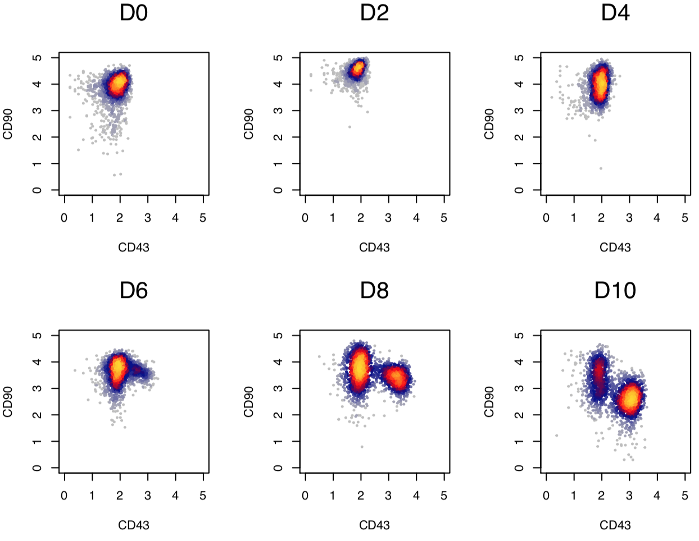 </center>

<center> **Heatscatter plot of CD43 and CD90 in each time point** </center>

Then we can create an FSPY object and begin analysis workflow. 

``` {r create-object, eval = T}

# Set markers in the analysis wrokflow
markers <- c("CD34", "CD43", "CD38", "CD90", "CD49f", "CD31", "CD45RA", "FLK1", "CD73")

# create an FSPY object using fspy.meta.data and fspy.raw.data
fspy <- createFSPY(raw.data = fspy.raw.data, markers = markers,
                   meta.data = fspy.meta.data,
                   log.transform = T)

# see information in object
fspy

```

In the analysis of FSPY workflow, it is recommended to remove batch effects for each time point. Batch effects in FCS data were usually caused by unstable voltage. In the example dataset, we collected cell sample at a specific time of each two days to make sure interval between every time point was equal. But batch effect is ineluctable. You can choose to use built-in function `correctBatchFSPY` provided in `flowSpy` packages, or you can choose to use other method before building an FSPY object. 
The methology of removing batch effects in `flowSpy` refers to `ComBat` function in  [`sva`](https://bioconductor.org/packages/release/bioc/html/sva.html) package. 

### 3.3 Classifying cells

Four cluster methods are provided in `flowSpy`: [`FlowSOM`](https://bioconductor.org/packages/release/bioc/html/FlowSOM.html), [`hclust`](https://www.rdocumentation.org/packages/stats/versions/3.6.0), [`kmeans`](https://www.rdocumentation.org/packages/stats/versions/3.6.0), and  [`mclust`](https://cran.r-project.org/web/packages/mclust/index.html). By default is `som` (FlowSOM) with both width and height of the grid is 6. `FlowSOM` is a package that can perform self-organizing maps for visualization and interpretation of cytometry data. Other clustering method will be added into flowSpy pacakages in the follow-up development. After running `runCluster` using default paramters, the log-transformed FCS data in FSPY will be divided into 36 clusters.

``` {r run-knn, eval = FALSE}

# Set knn 30
fspy <- runKNN(fspy, knn = 30)

# Set random seeds to ensure the results repeatably
set.seed(1)
fspy <- runCluster(fspy, cluster.method = "som")

```

### 3.4 Reducing dimensionality

In `flowSpy` package, four methods are provided: Principal Components Analysis (PCA), t-distributed Stochastic Neighbor Embedding (tSNE), Diffusion Maps and Uniform Manifold Approximation and Projection (UMAP). You can use `runFastPCA` to run PCA, `runTSNE` to run tSNE, `runDiffusionMap` to run Diffusion Map, and `runUMAP` to run UMAP. Each function are relatively independent. Before run reducing dimensionality, the `runKNN` is required to be run first.

PCA in `flowSpy` is base on `fast.prcomp` in [gmodels](https://cran.r-project.org/web/packages/gmodels/index.html) package. You can use `?runFastPCA` to get more information.

``` {r run-pca, eval = FALSE}

# run PCA
fspy <- runFastPCA(fspy)

# Visualize first two PCs and colored by cluster
plot2D(fspy, item.use = c("PC1", "PC2"), color.by = "cluster.id", 
       alpha = 0.7, main = "PCA colored by cluster.id")
```

<center> 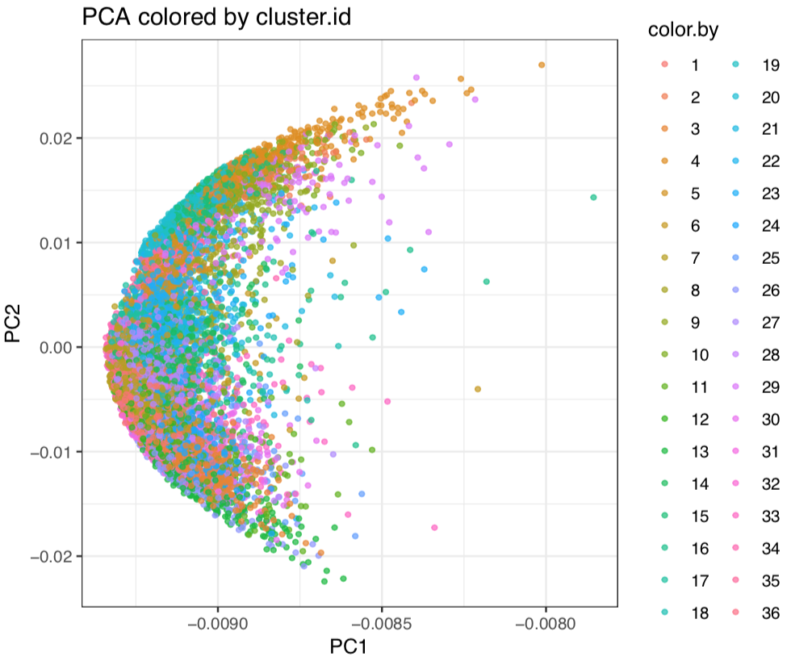 </center>

<center> **PCA plot colored by cluster.id** </center>


``` {r plot-pca-stage, eval = FALSE}

# Visualize first two PCs and colored by stage
plot2D(fspy, item.use = c("PC1", "PC2"), color.by = "stage", 
       alpha = 0.7, main = "PCA colored by stage")

```


<center> 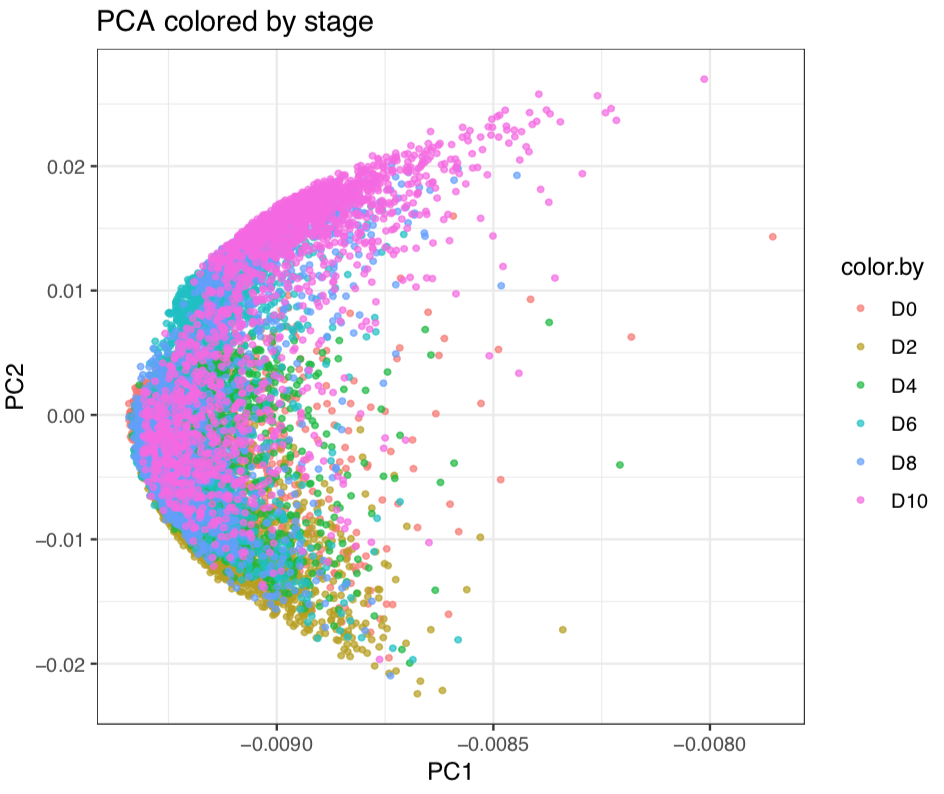 </center>

<center> **PCA plot colored by stage** </center>

`flowSpy` also provide three dimension plot, you can specify your axis using `item.use` in `plot3D`.

``` {r run-pca-3d, eval = FALSE}

# 3D plot
plot3D(fspy, item.use = c("PC1", "PC2", "PC3"), color.by = "stage", main = "PCA")

```

<center> 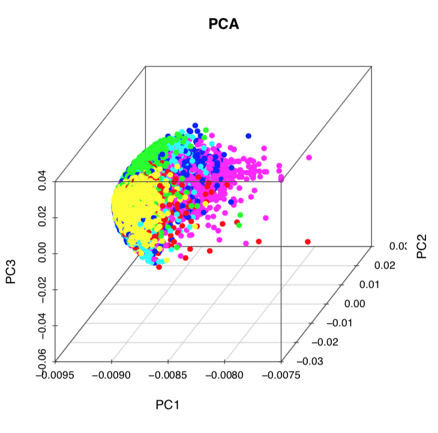 </center>

<center> **3D PCA plot colored by stage** </center>

t-SNE is an algorithm for dimensionality reduction that is well-suited to visualizing high-dimensional data. In `flowSpy`, you can use `runTSNE` function to run tSNE, and show the cluster id by setting `show.cluser.id = TRUE`. Also, perplexity parameter can be set by `perplexity = 20`, by default is 30. This function is developed based on `Rtsne` function in [Rtsne](https://cran.r-project.org/web/packages/Rtsne/index.html) package. You can use `?runTSNE` or `?Rtsne` to get more information.

``` {r run-tsne, eval = FALSE}

# Run tNE
fspy <- runTSNE(fspy)

plot2D(fspy, item.use = c("tSNE1", "tSNE2"), color.by = "cluster.id", 
       alpha = 1, main = "tSNE plot colored by cluster.id", show.cluser.id = T)

```

<center> 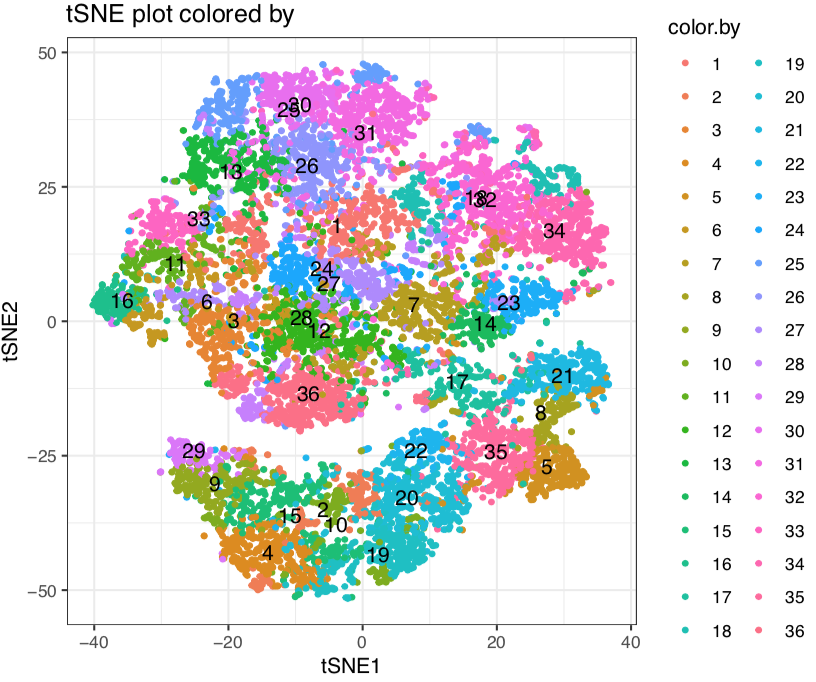 </center>

<center> **tSNE plot colored by cluser.id** </center>

Diffusion maps is a dimensionality reduction algorithm, it computes a family of embeddings of a data set into Euclidean space. In `flowSpy`, Diffusion map of FCS data can be calculated using `runDiffusionMap` function, and this function is based on `DiffusionMap` in [destiny](https://bioconductor.org/packages/release/bioc/html/destiny.html) package.

``` {r run-destiny, eval = FALSE}

# Run Diffusion map
fspy <- runDiffusionMap(fspy)

plot2D(fspy, item.use = c("DC1", "DC2"), color.by = "stage", 
       alpha = 1, main = "DiffusionMap plot colored by stage")
```

<center> 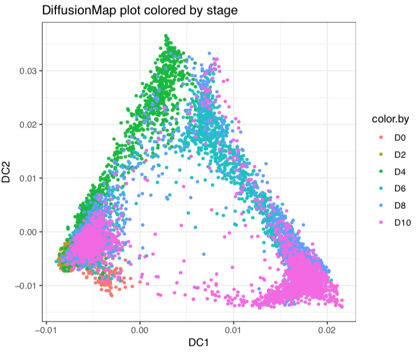 </center>

<center> **DiffusionMap plot colored by stage** </center>

Also, 3D plot of first three DCs in Diffusion map can be visualized by `plot3D` function.

``` {r run-destiny-3d, eval = FALSE}

plot3D(fspy, item.use = c("DC1", "DC2", "DC3"), color.by = "stage",
       main = "3D DiffusionMap plot colored by stage")

```

<center> 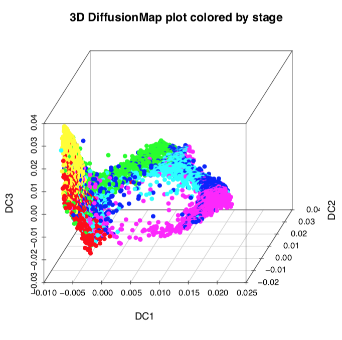 </center>

<center> **3D DiffusionMap plot colored by stage** </center>

Uniform Manifold Approximation and Projection (UMAP) is a dimension reduction technique that can be used for visualisation similarly to t-SNE, but also for general non-linear dimension reduction. You can use `runUMAP` function to run UMAP. This function is developed based on `umap` in [umap](https://github.com/lmcinnes/umap) package.

``` {r run-umap, eval = FALSE}

# Run UMAP
fspy <- runUMAP(fspy)

# Color by cluster
plot2D(fspy, item.use = c("UMAP1", "UMAP2"), color.by = "cluster.id", 
       alpha = 0.7, main = "UMAP plot colored by cluster", show.cluser.id = T)

# Color by stage
plot2D(fspy, item.use = c("UMAP1", "UMAP2"), color.by = "stage", 
       alpha = 0.7, main = "UMAP plot colored by stage", show.cluser.id = F)

```

<center> 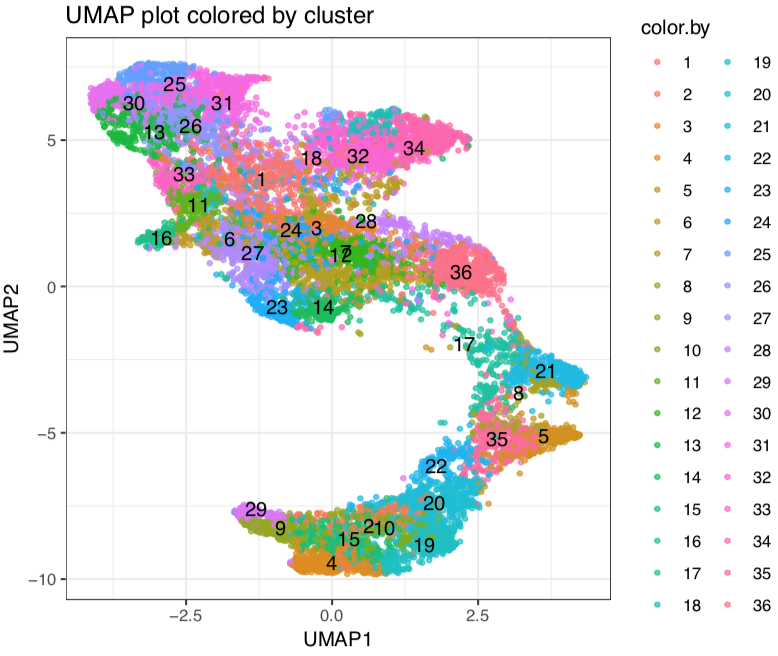 </center>

<center> **UMAP plot colored by cluster** </center>

<center> 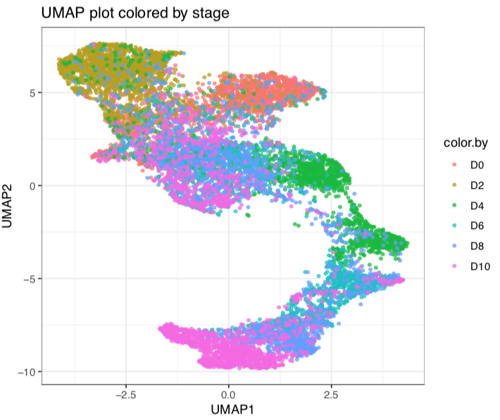 </center>

<center> **UMAP plot colored by stage** </center>


### 3.5 Build tree

During development, Human embryonic stem cells were induced into Hematopoietic Stem/Progenitor cells in response to stimuli. Surface cellular markers transformed from one "states" to another. Cells in different states expressed different sets of genes, and their surface markers continuous changed during the induction. As cells moving between different states, construction of development tree could help us see the induction process more intuitively. In `flowSpy`, Minimum Spanning Tree is used to construct tree of different cluster of cells. 

``` {r build-tree, eval = F, fig.width = 6, fig.height = 4}

# Build Minimum Spanning Tree base on som cluster and umap
fspy <- buildTree(fspy, cluster.type = "som", dim.type = "umap")

# Plot MST
p <- plotTree(fspy, color.by = "D0.percent.stage", show.node.name = T) 
p + scale_colour_gradientn(colors = c("blue", "red"))

```

<center> 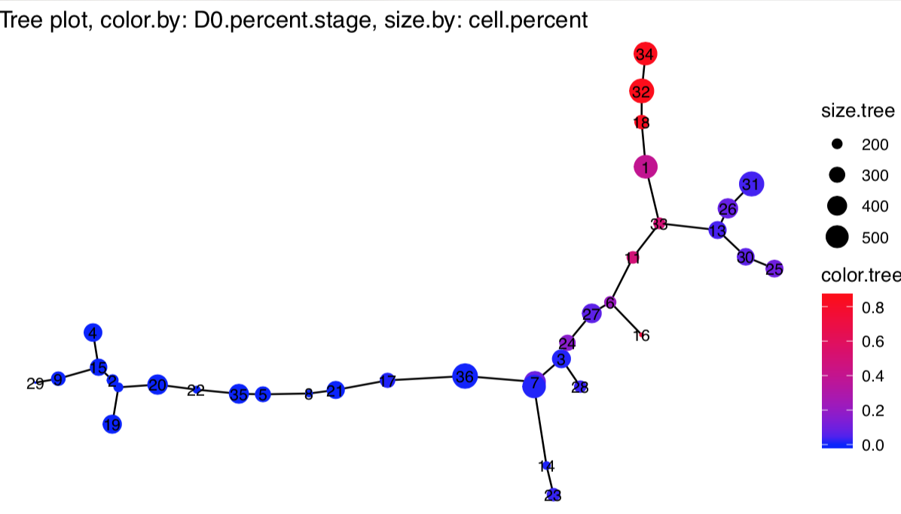 </center>

<center> **Tree plot color by cell percentage in D0** </center>

### 3.6 Pseudotime calculation

From the tree, you can see cell percentage in D0 are concentrated at node 34 and 32, so we can suggest node 34 is the initial state of all cell clusters. Cell in node 34 are defined as root cells using function `defRootCells`. And then you can caluclate pseudotime using `runPseudotime` function.

``` {r pseudotime, eval = FALSE}

# Define root cells
fspy <- defRootCells(fspy, root.cells = c(34))

# Calculate pseudotime
fspy <- runPseudotime(fspy)

# Visualize pseudotime density in each time point
plotPseudotimeDensity(fspy)

```

<center> 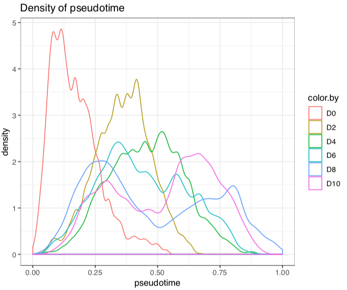 </center>

<center> **Pseudotime density in each time point** </center>

You can also visualize pseudotime using `color.by = "pseudotime"`. Pseudotime in each node is caluclate from mean value of persudotime in each cell of this node.

``` {r pseudotime-tree, eval = FALSE}

# Pseudotime in umap
p <- plotTree(fspy, color.by = "pseudotime", show.node.name = T, 
              as.tree = T, root.id = 34) 
p + scale_colour_gradientn(colors = c("blue", "red"))

```

<center> 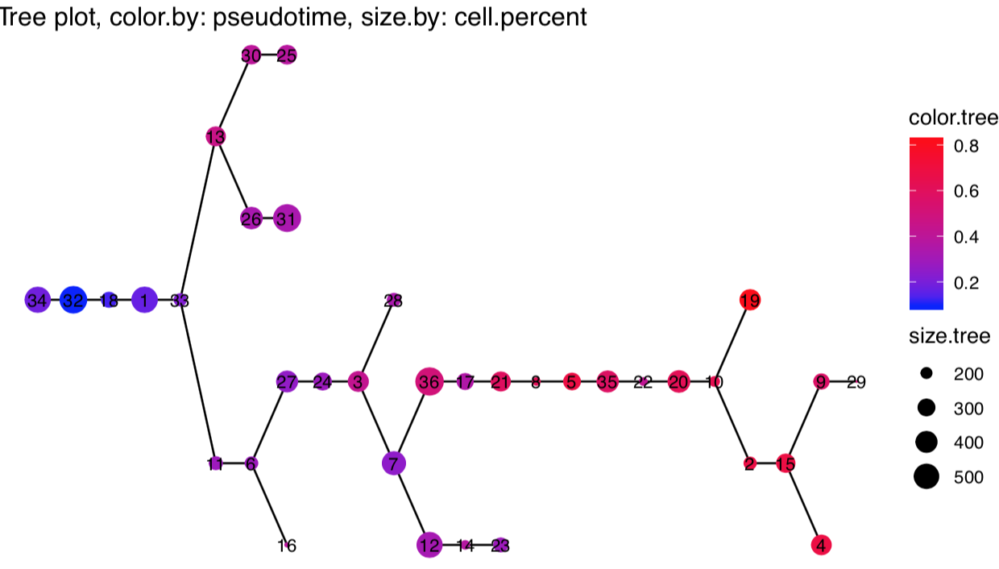 </center>

<center> **Pseudotime visualized in tree** </center>

You can also visualize pseudotime in 2D or 3D plot.

``` {r pseudotime-umap, eval = FALSE}

# Pseudotime in each cluster
p <- plot2D(fspy, item.use = c("UMAP1", "UMAP2"), 
            color.by = "pseudotime", alpha = 1,
            main = "Pseudotime in UMAP")
p + scale_colour_gradientn(colors = c("#00599F", "#EEEEEE", "#FF3222"))

```

<center> 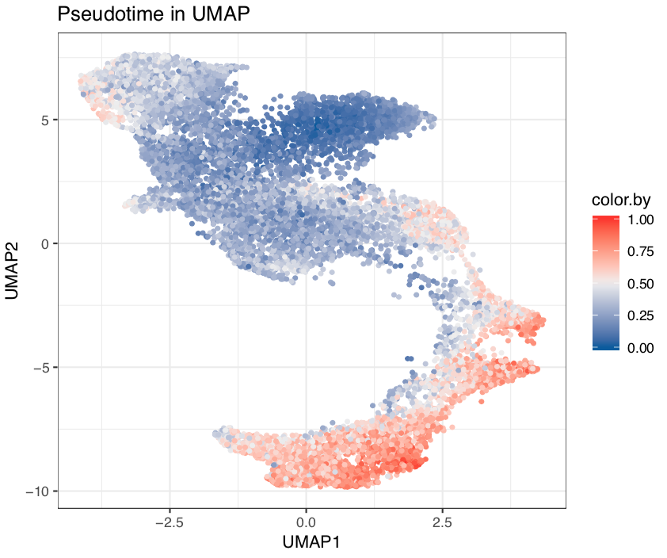 </center>

<center> **Pseudotime visualized in UMAP** </center>

``` {r pseudotime-diffusion-map, eval = FALSE}

# Pseudotime in diffusion map
plot3D(fspy, item.use = c("pseudotime", "DC1", "DC2"), 
       color.by = "pseudotime", size = 0.5)

```

<center> 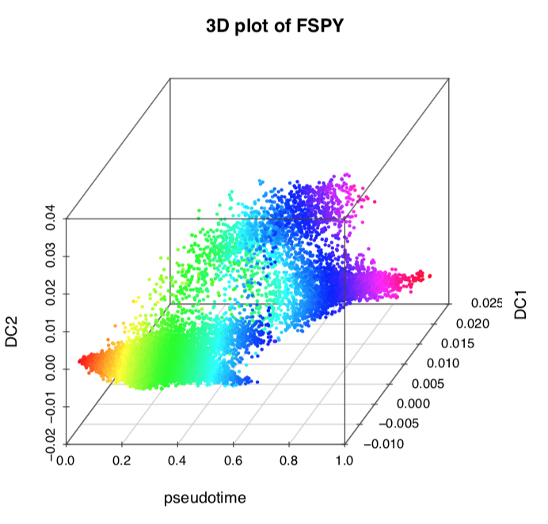 </center>

<center> **Pseudotime visualized in 3D plot using DC1 and DC2** </center>


### 3.7 Trajectory inference

Before running trajectory inference in `flowSpy`, you need to specify leaf cells first. Leaf cells in trajectory inference represent terminal state of development. In this experiment, Hematopoietic Stem/Progenitor cells generated in Day 8 shows CD43+CD34+CD38-CD45RA-CD90+ surface marker character, which present in node 4, 9 and 29. So we set node 4, 9 and 39 as leaf cells.

``` {r Trajectory, eval = FALSE}

# Define leaf cells
fspy <- defLeafCells(fspy, leaf.cells = c(4,9,29))

# run walks between root cells and leaf cells
fspy <- runWalk(fspy)

# show pseudotime trajectory of all cells
p <- plotPseudotimeTraj(fspy, cutoff = -1, var.cols = T)
p + scale_colour_gradientn(colors = c("#00599F","#0B85E2","#EEEEEE","#FC6055","#FF3222"))

```

<center> 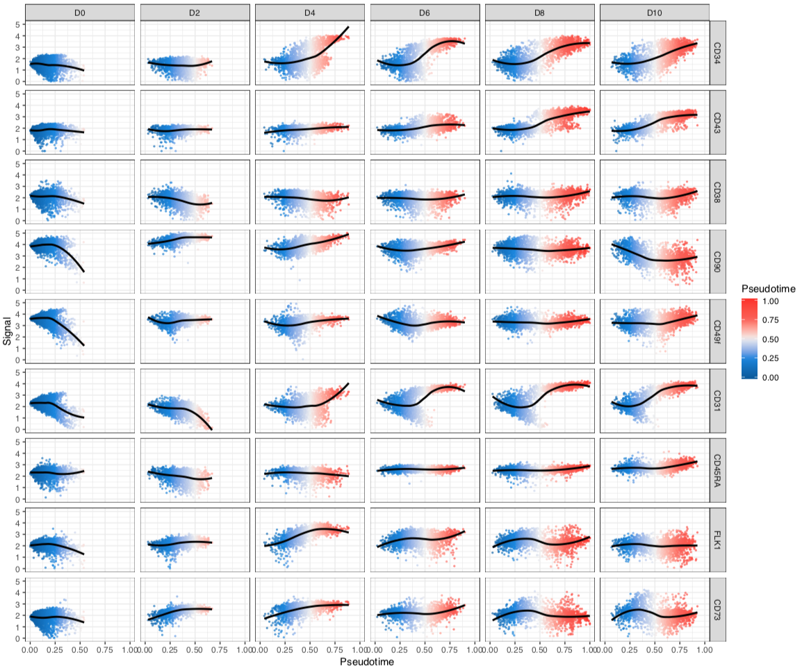 </center>

<center> **Trajectory plot using all cells** </center>

``` {r Trajectory-traj.value, eval = FALSE}

# show pseudotime trajectory with trajectory value over 0.1
p <- plotPseudotimeTraj(fspy, cutoff = 0.2, var.cols = T)
p + scale_colour_gradientn(colors = c("#00599F","#0B85E2","#EEEEEE","#FC6055","#FF3222"))

```

<center> 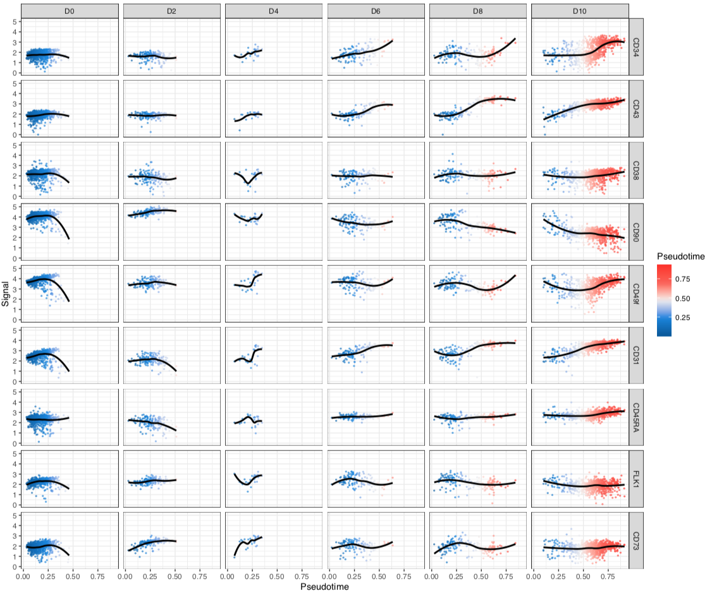 </center>

<center> **Trajectory plot using cells with log.traj.value over 0.2** </center>

You can use plot2D to visualize distribution of log trajectory value.

``` {r Trajectory-traj.value-distribution, eval = FALSE}

plot2D(fspy, item.use = c("pseudotime", "traj.value.log"), color.by = "stage")

```

<center> 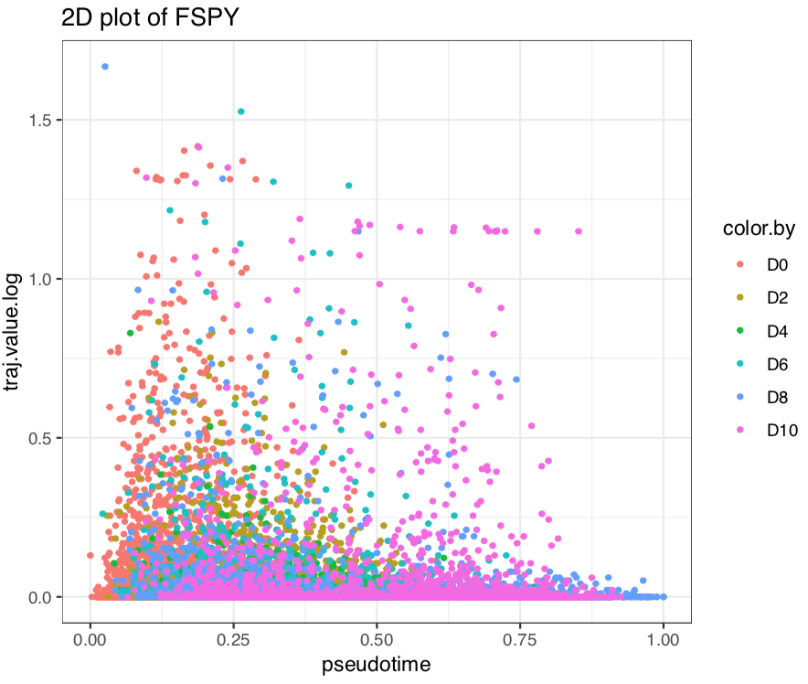 </center>

<center> **Distribution of tajectroy value** </center>

``` {r Trajectory-heatmap, eval = FALSE}

library(pheatmap)

# Fetching meta.data from fspy
plot.info <- fetchPlotMeta(fspy)

plot.info <- plot.info[, c(markers, "pseudotime")]
plot.info <- plot.info[order(plot.info$pseudotime), ]
plot.info <- plot.info[, match(c("CD34", "CD43","CD31","CD45RA","CD38",
                                 "CD49f","CD90","FLK1","CD73"), colnames(plot.info))]
pheatmap(t(plot.info),
         color = colorRampPalette(c(rep("#00599F",3),"#FFFFFF",rep("#FF3222",3)))(100),
         cluster_rows = F, cluster_cols = F, scale = "row", fontsize_col = 0.01)

```

<center> 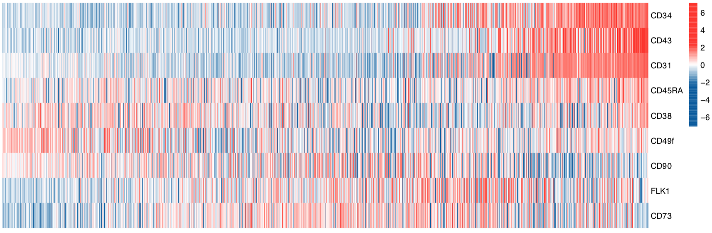 </center>

<center> **Heatmap of markers order by pseudotime** </center>

### 3.8 Define intermediate states

Cells in intermediate stats plays an key role in cell development and stats transition. Cell with higher trajectory value may present the higher probility to be treated as an intermediate stat cell.

``` {r subset, eval = FALSE}

# fetch cell with traj.value.log > 0.2 or root or leaf cells
fetch.cells <- fetchCell(fspy, traj.value.log = 0.2, is.root.cells = 1, is.leaf.cells = 1)

# 1877 cell will be fetched
sub.fspy <- subsetFSPY(fspy, cells = fetch.cells)

```

Then you can do clustering and dimensionality reduction to visualize the trajectory of the filtered cells.

### 3.9 Save object

Saving FSPY object in `Robj` format.

``` {r save-object, eval = FALSE}

# save FSPY object
save(fspy, file = "path to your fspy.Robj")

```

## 4 Advanced usage

### 4.1 The FSPY class

<center> **Structure of FSPY object** </center>

<center> 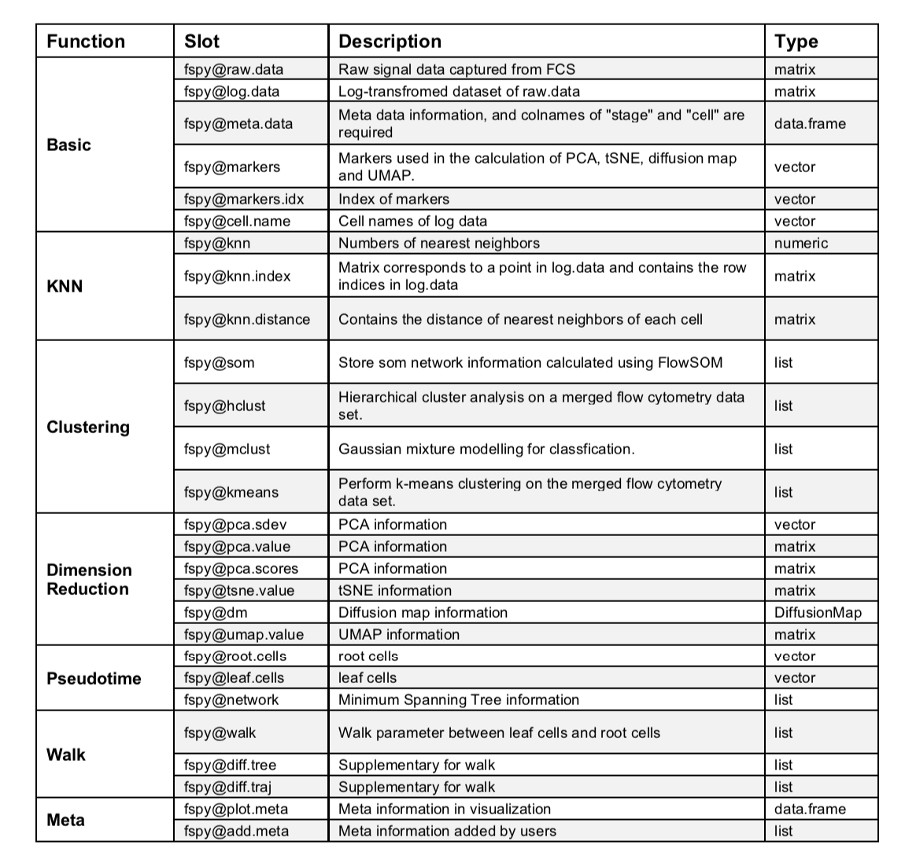 </center>

### 4.2 Pseudotime algorithm

<center> 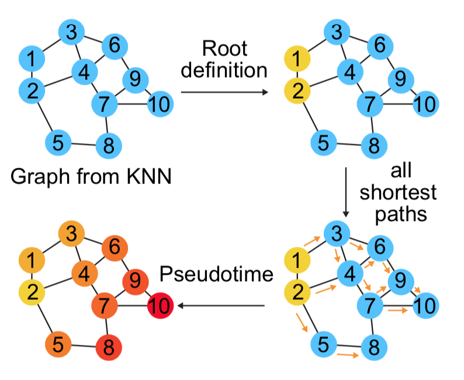 </center>

<center> **Algorithm of pseudotime** </center>

### 4.3 Trajectory inference algorithm

<center> 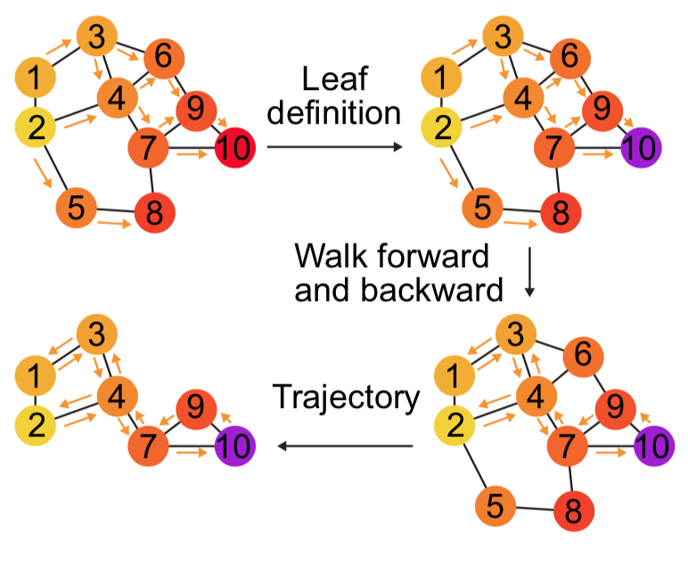 </center>

<center> **Algorithm of trajectory inference** </center>

## Session info 

``` {r}
sessionInfo()
```

## Acknowledgments
This work was supported by National Natural Science Foundation of China (Grants 81570122 and 81770205).

## References
[1] Sofie Van Gassen, Britt Callebaut and Yvan Saeys (2019). FlowSOM: Using
  self-organizing maps for visualization and interpretation of cytometry data.
  http://www.r-project.org, http://dambi.ugent.be.

[2] Qiu, P., et al., Extracting a cellular hierarchy from high-dimensional cytometry data with SPADE. Nat Biotechnol, 2011. 29(10): p.886-91.


